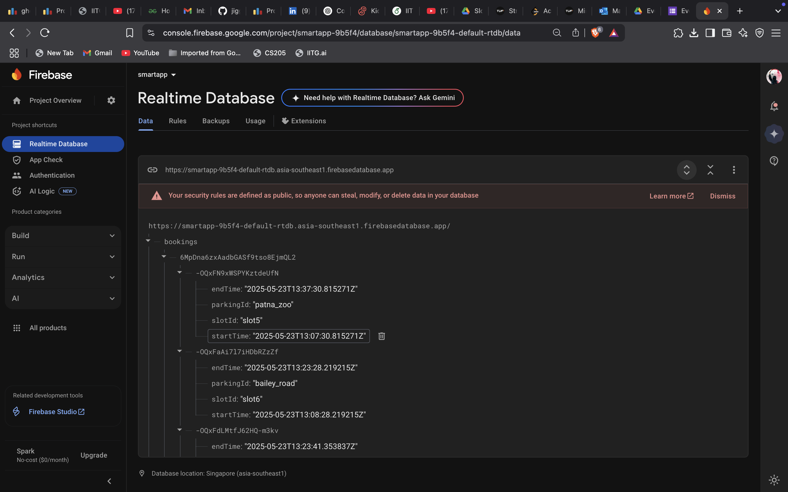
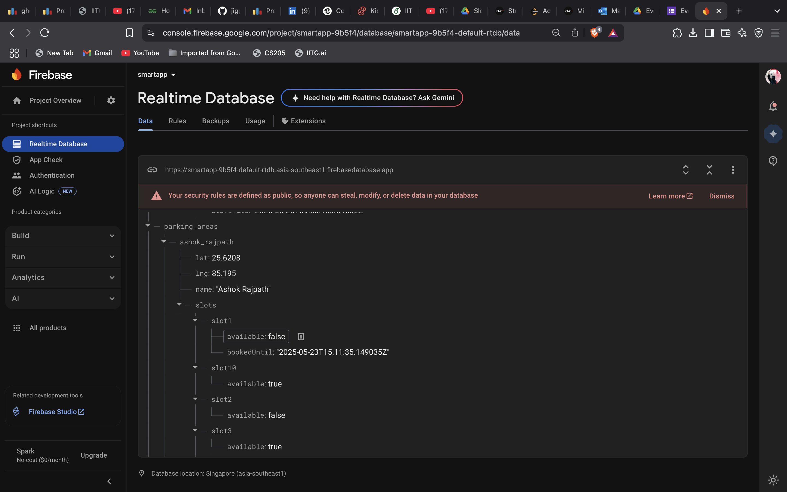
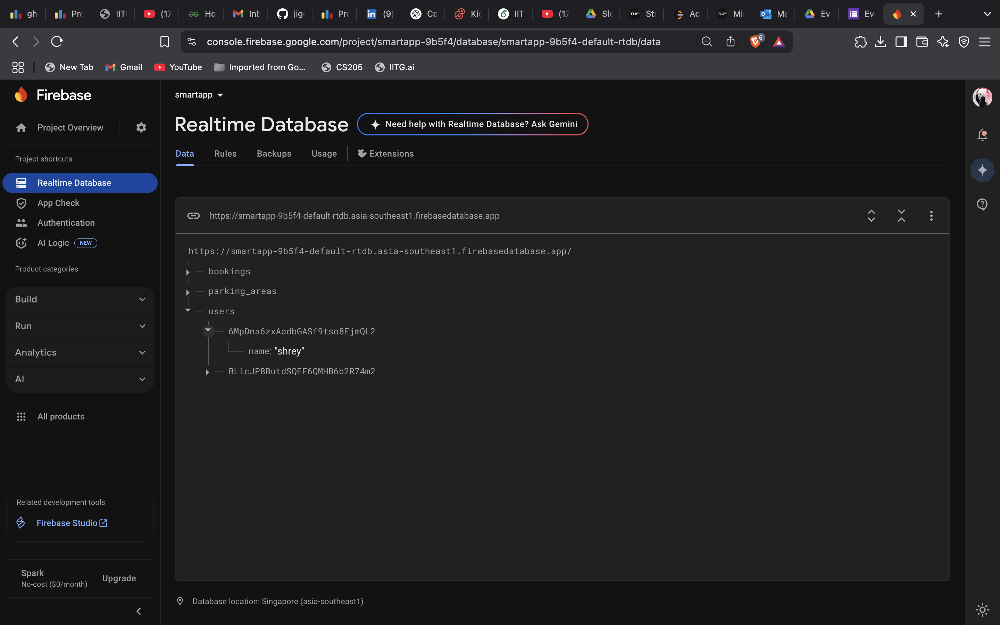

# 🚗 Smart Park App

A user-friendly parking management mobile application designed to simplify the process of finding, booking, and paying for parking slots. The app offers a clean and intuitive interface with useful features like booking history, dark mode, real-time updates, and secure payment integration.

---

## 📱 Features

- 🔍 Browse available parking slots with real-time availability  
- 🗓️ Book slots for specific dates and time ranges  
- 📄 View booking details before confirmation  
- 💳 Make secure payments via Razorpay  
- 🧾 View booking history  
- ⚙️ Customize app settings  
- 🌙 Dark mode for comfortable nighttime use  
- 🔐 Firebase Authentication & Realtime Database integration  

---

## 📸 App Screenshots

Below are screenshots demonstrating the app's user interface and backend integration.

### 🔐 Login Page  
Secure login screen using Firebase Authentication.

### 🏠 Home Page  
The main landing screen where users can quickly access core features and navigation.

### ☰ Navigation Menu  
Sidebar drawer with shortcuts to Settings, About Us, and Logout.

### 🗓️ Booking Slots  
Shows available parking slots based on date/time and current availability.

### 📄 Booking Details  
Displays the slot selected, timings, and other details for confirmation.

### 💳 Payment  
Seamless in-app payment integration using Razorpay gateway.

### 🧾 Booking History  
List of previously booked slots with dates, times, and slot IDs.

### ⚙️ Settings  
Lets users manage preferences like notifications, theme, and more.

### 🌙 Dark Mode  
Dark mode UI for a better experience in low-light environments.

---

## 🔄 Firebase Realtime Database

Smart Park uses Firebase Realtime Database to manage and sync parking-related data in real-time across all users and sessions. This includes storing user profiles, booking details, and live slot availability.

