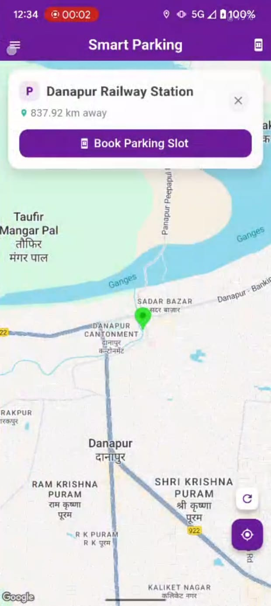

# Smart Park App

A user-friendly parking management mobile application designed to simplify the process of finding, booking, and paying for parking slots. The app offers a clean and intuitive interface with useful features like booking history and dark mode for enhanced usability.

---

## 📱 Features

- Browse available parking slots with real-time availability updates  
- Book parking slots for specific dates and times  
- View booking details before confirmation  
- Secure payment integration for seamless transactions  
- Access booking history to track past reservations  
- Customize app settings for a personalized experience  
- Dark mode support for comfortable usage in low-light conditions  

---

## 📸 App Screenshots

Below are screenshots demonstrating the main user interface screens of the app. These images showcase the design and layout of various features, helping you visualize the user experience.

### 🔐 Login Page  
Secure login screen allowing users to sign in with their credentials or social accounts to access the app.

### 🏠 Home Page  
The main landing screen where users can quickly access core features and navigation.

### ☰ Navigation Menu  
Quick access menu from the home screen, allowing users to easily reach Settings, About Us, and other important sections.

### 🗓️ Booking Slots  
Screen displaying available parking slots for users to select and book.

### 📄 Booking Details  
Summary of booking information including date, time, and slot details before confirmation.

### 💳 Payment  
Interface for users to enter payment details and complete the booking transaction.

### 🧾 Booking History  
List of past bookings, allowing users to review their parking history.

### ⚙️ Settings  
Configuration options for personalizing the app experience, such as notification preferences.

### 🌙 Dark Mode  
Example of the app’s dark mode theme, providing a visually comfortable interface for low-light environments.

